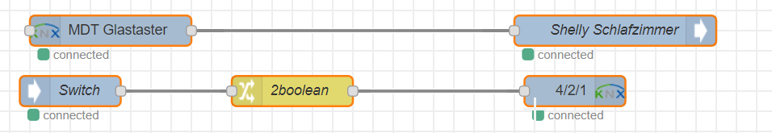

# smartathome
**These are all proof of concepts. I am sure some developments can be done better. Please raise an issue for questions, suggestions ore any comments.**

# Introduction
Actually I wanted to create a blog, but I dont have time right now. I might migrate that stuff later and even create a video. 
On smartathome I will collect my ideas around **KNX** and integration with other smarthome solutions like iobroker, openhab and especially Node-Red. I will show you how to potentially save a lot of money using opensource technologys. I am not a coder, i am a consultant, so please be patient.   For now I will not show the setup in ETS. 
Stay tuned!

## You need...
* Raspberry Pi or any other device which can run Node-Red, Iobroker and Openhab.
* Node-Red and some nodes for KNX and Alexa (KNX Easy and Alexa Local)
* Openhab is the easy way to integrate Google Home
* iobroker as the connector and powerfull engine in between
* ETS5 to configure KNX group addresses. With that it wont work! 

## Node-Red Flows
### KNX to AnyDevice
* Example to switch any device connected to Node-Red with a KNX Sesnor like the MDT Glastaster 2. In this proof of concept I am switching a Sheely device with the MDT Glastaster.  
Node-Red Flow:  
https://github.com/jensfr1/smartathome/blob/master/knx_externalswitch.js

### AnyDevice to KNX
* Example on how to switch a KNX actor with any Device which can be connected to Node-Red. This examples shows a Xiomi Mi switch to control a KNX Actor.   Node-Red Flow:  
https://github.com/jensfr1/smartathome/blob/master/mi_knx.js

### Alexa and KNX
* Example flow to switch any KNX device with Alexa. Node-Red Flow:  
https://github.com/jensfr1/smartathome/blob/master/alexa_knx.js

### Homekit and KNX
* Example flow to switch any KNX device with Siri / Homekit. Node-Red Flow:  
https://github.com/jensfr1/smartathome/blob/master/homekit_knx

### Send weather data from InfluxDB to KNX 
* PM 2.5 and PM10 data from luftdaten.info will be shown on MDT Glastaster  
soon

### Send data from Netatmo Public API to KNX
* Get rain and wind information from nearby weather stations into KNX.  
soon

## Openhab Examples
### Setup Google Home (Nest Home Hub) Integration for KNX Devices

